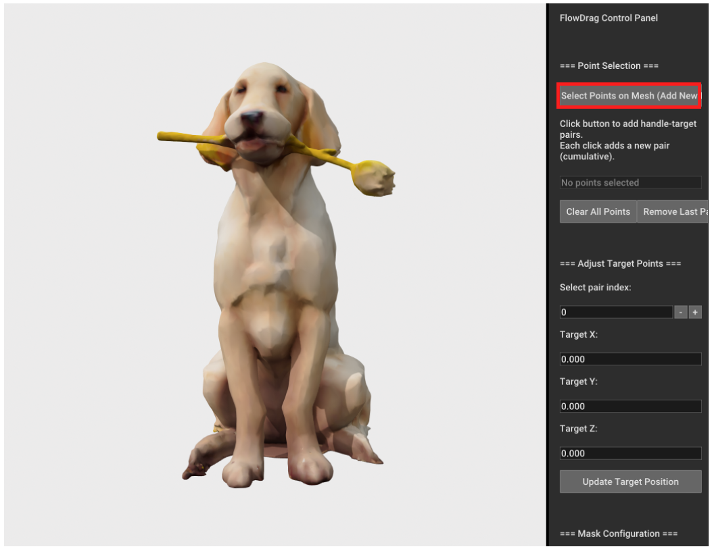
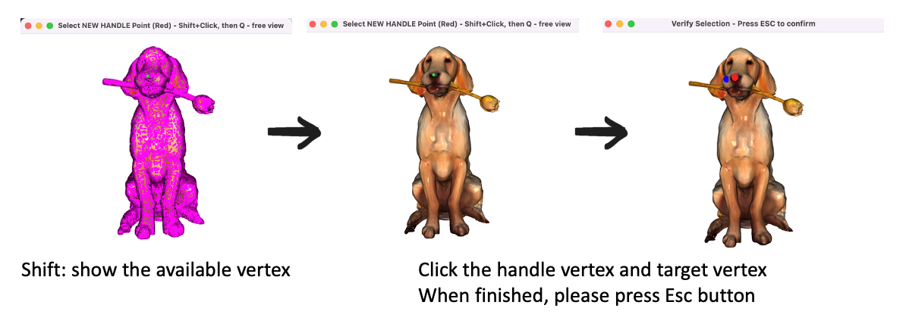
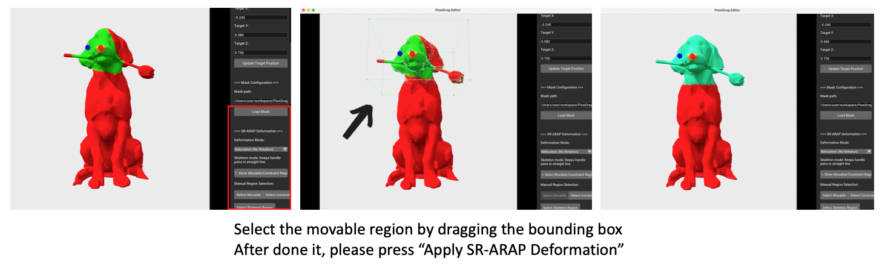
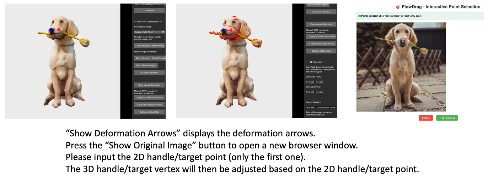
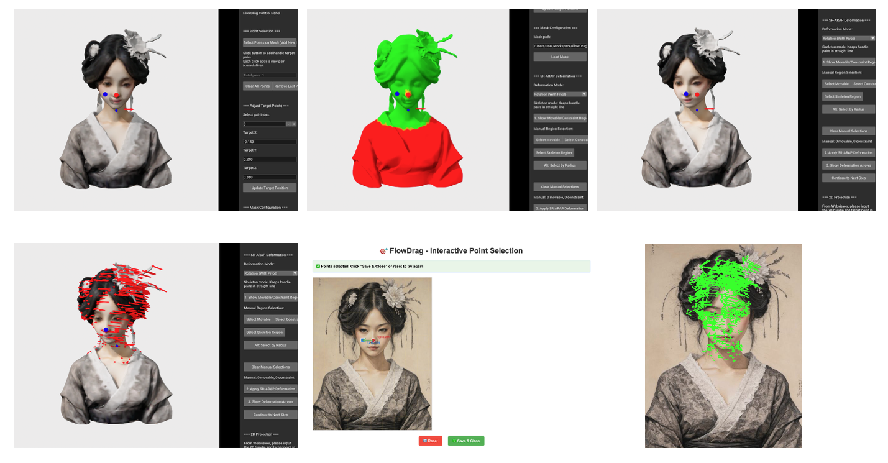
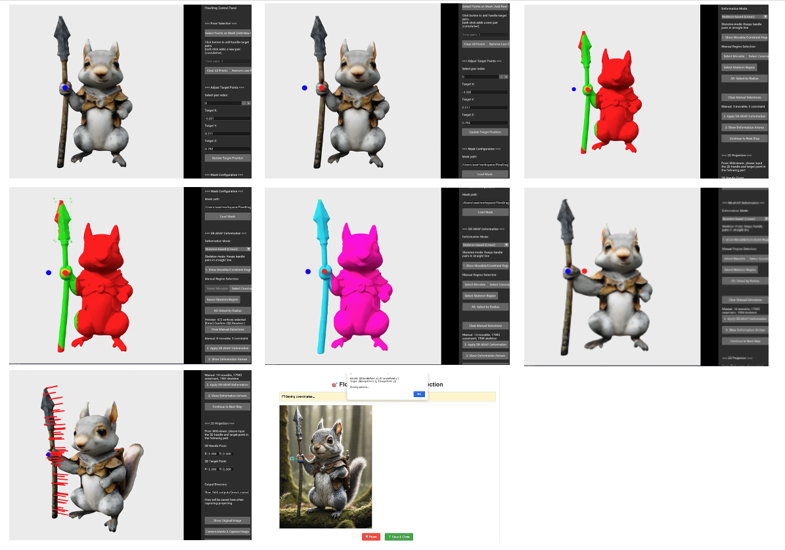

# Mesh Deformation UI Guide

This guide provides step-by-step instructions for using the mesh deformation UI to generate 3D-aware flow fields for FlowDrag.

## Quick Start

```bash
cd mesh_deformation
python flowdrag_mesh_deform_ui.py
```

## Workflow Overview

The mesh deformation process consists of the following steps:

1. Load 3D mesh and select control points
2. Define movable and constraint regions
3. Apply SR-ARAP deformation
4. Project 3D deformation to 2D image space
5. Generate 2D vector flow field for FlowDrag

---

## Step-by-Step Guide

### 1. Point Selection

<div align="center">
  
</div>

<div align="center">
  
</div>

**Action:** Click the **"Select Points on Mesh"** button to open the 3D visualization window.

**Instructions:**
- **Handle Vertices (Red)**: Hold `Shift` and click to select the source points you want to move
  - These points should be on the mesh surface
  - Press `Q` to confirm handle point selection
  
- **Target Vertices (Blue)**: Continue holding `Shift` and click to select destination points
  - Can be on the mesh surface or in empty space
  - Press `Q` to confirm target point selection
  
- **Complete**: Press `Esc` to finish point selection and return to the control panel

> **Note:** The handle vertices represent the initial positions, while target vertices represent where you want the mesh to deform to.

---

### 2. Adjust Target Vertices

<div align="center">
  
</div>

After returning to the control panel, you can fine-tune target point positions:

- Use the **"Adjust Target Points"** sliders to modify target vertex positions
- Changes are reflected in real-time in the 3D view
- This allows precise control over the deformation magnitude and direction

---

### 3. Load Mask

<div align="center">
  
</div>

Define which regions of the mesh can be deformed:

**Regions:**
- **Movable Region** (Green): Can be freely deformed using SR-ARAP energy function
- **Constraint Region** (Red): Fixed and will not be deformed

**Action:** Click **"Load Mask"** to automatically set regions based on the input mask

> **Note:** The automatic region detection is convenient but may be imprecise. Manual adjustment is recommended (see Step 5).

---

### 4. SR-ARAP Deformation Modes

Choose the appropriate deformation mode based on your editing needs:

#### **Relocation (No Rotation)**
- Basic SR-ARAP algorithm
- Best for simple translation/relocation tasks
- Preserves local shape without enforcing rotation

#### **Rotation (with Pivot)**
- Recommended for rotation-based edits
- Automatically sets pivot at the center of mass of the movable region
- Enhances rotation term in SR-ARAP energy function
- Best for rotating objects or parts (e.g., head rotation)

#### **Skeleton-based (Linear)**
- Ideal for articulated motion
- Preserves overall structure while allowing deformation
- Best for skeletal edits (e.g., arm movement, pose changes)
- Select skeleton region to maintain structural integrity

---

### 5. Manual Region Selection (Optional)

For more precise control over movable and constraint regions:

1. Click **"1. Show Movable/Constraint Region"** to visualize current regions
   - Green: Movable region
   - Red: Constraint region

2. Click **"Select Movable/Constraint"** to enter selection mode
   - Drag to select vertices
   - Use **"Alt: Select by Radius"** for easier selection if dragging is difficult

3. Refine regions until satisfied with the deformation area

---

### 6. Apply SR-ARAP Deformation

<div align="center">
  
</div>

Execute the deformation:

1. Click **"Apply SR-ARAP Deformation"** to process the mesh deformation
2. Click **"Show Deformation Arrows"** to visualize the 3D deformation vectors
   - Arrows indicate direction and magnitude of deformation
   - Verify that the deformation looks correct

---

### 7. 2D Projection Setup

Align the 3D deformation with your 2D input image:

1. Click **"Show Original Image"** to open a new browser window
2. In the 2D image view, select handle and target points:
   - Select the same semantic points as in the 3D mesh
   - Ensure correspondence between 3D and 2D points

> **Important:** Accurate 2D point placement is crucial for proper projection alignment.

---

### 8. Camera Matrix & Image Capture

Capture the current view for projection:

- The camera matrix is automatically calculated from the current 3D viewport
- The rendered image is captured from this viewpoint
- Ensure the 3D mesh viewpoint matches your input image perspective

---

### 9. Auto-align to Input Image & 2D Projection

Project the 3D deformation to 2D image space:

1. Click **"Auto-align to Input Image & 2D Projection"**
2. The system automatically aligns 3D handle/target vertices with 2D points
3. Results are saved to:
   ```
   flow_field_outputs/{sample_name}/2d_vector_flow_field.npy
   flow_field_outputs/{sample_name}/2d_vector_flow_field.png
   ```

**Output Files:**
- `2d_vector_flow_field.npy`: Dense 2D flow field (input for FlowDrag)
- `2d_vector_flow_field.png`: Visualization with arrows

---

### 10. Flow Scale Factor Adjustment

Fine-tune the visualization and flow magnitude:

- Adjust **"Flow Scale Factor"** slider to modify arrow size
- If arrows are too long or obscure the image, decrease the scale factor
- This only affects visualization; the `.npy` file contains the original flow magnitudes

---

## Output Usage

The generated `2d_vector_flow_field.npy` can be directly used as input for FlowDrag:

```python
import numpy as np

# Load the flow field
flow_field = np.load('flow_field_outputs/{sample_name}/2d_vector_flow_field.npy')

# Use in FlowDrag pipeline
# (See main FlowDrag documentation for integration)
```

---

## More Examples

### Woman Example

This example demonstrates head rotation editing using the mesh deformation UI:

<div align="center">
  
</div>

### Squirrel Example

This example showcases skeleton-based constraints (light blue regions) for articulated motion:

<div align="center">
  
</div>


## Tips & Best Practices

1. **Point Selection**: Choose semantically meaningful points (e.g., eye, nose, ear) for better correspondence
2. **Region Definition**: Carefully define movable regions to avoid unwanted deformation
3. **Deformation Mode**: Experiment with different SR-ARAP modes to find the best result
4. **Camera Alignment**: Ensure 3D viewpoint closely matches 2D image perspective
5. **Flow Scale**: Start with default scale and adjust based on visual inspection

---

## Troubleshooting

**Issue:** Deformation looks unnatural
- **Solution:** Adjust movable/constraint regions or try a different SR-ARAP mode

**Issue:** 2D projection is misaligned
- **Solution:** Re-select 2D points more carefully or adjust camera viewpoint

**Issue:** Flow arrows are too large/small
- **Solution:** Adjust the Flow Scale Factor slider

**Issue:** Can't select points properly
- **Solution:** Use "Alt: Select by Radius" mode instead of dragging

---

## Requirements

- Open3D (for 3D visualization)
- NumPy
- Gradio
- Local machine with display recommended (for interactive 3D viewer) 